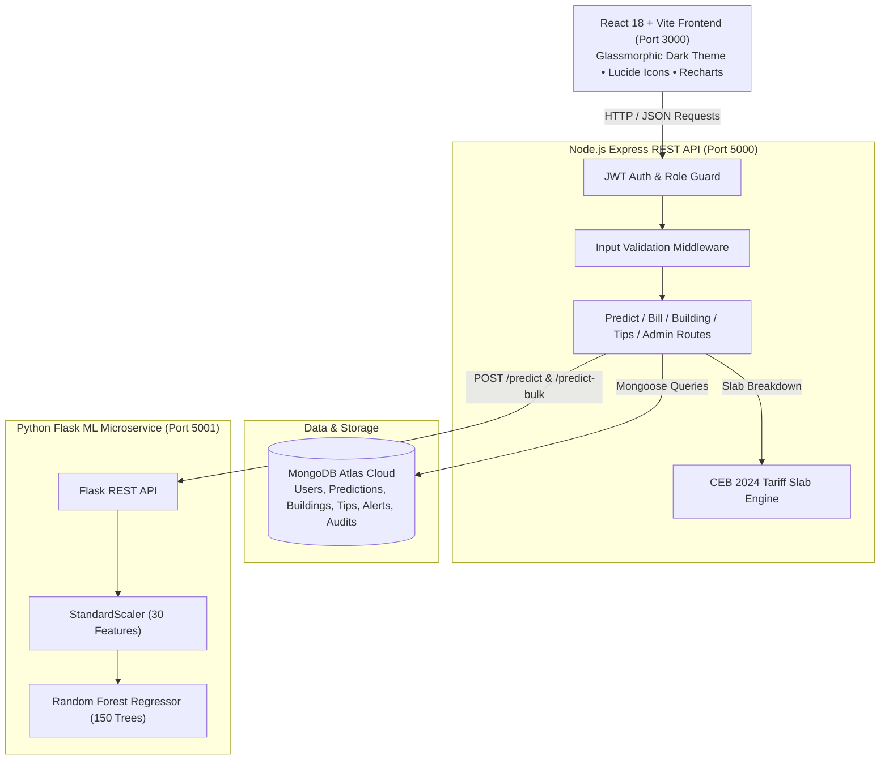
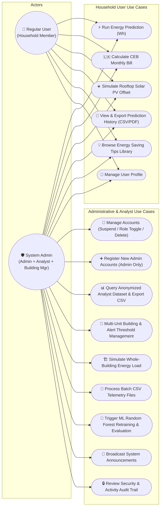
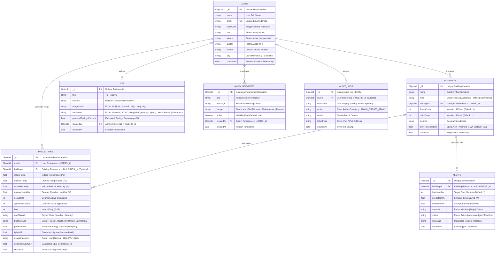
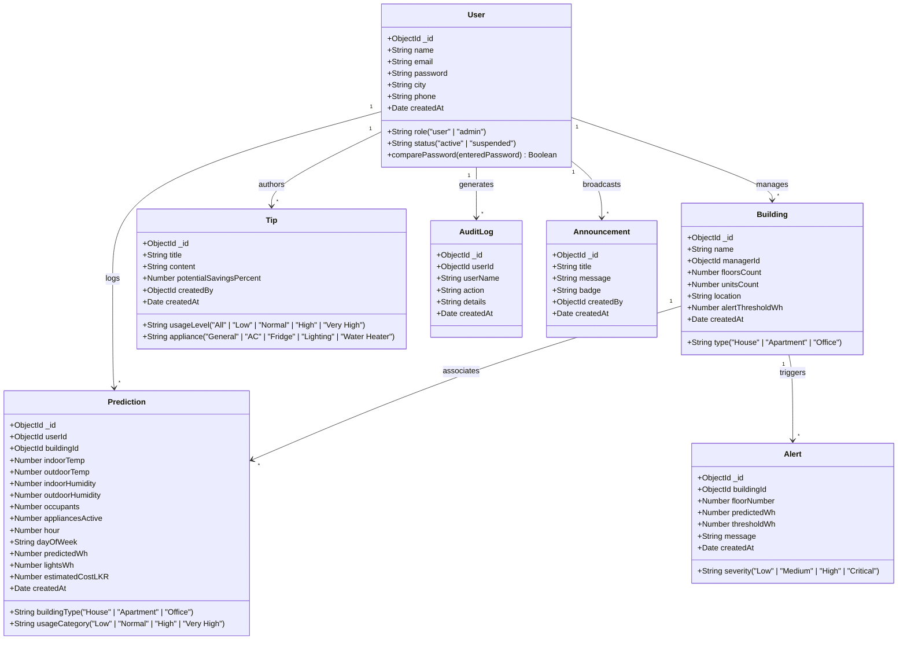
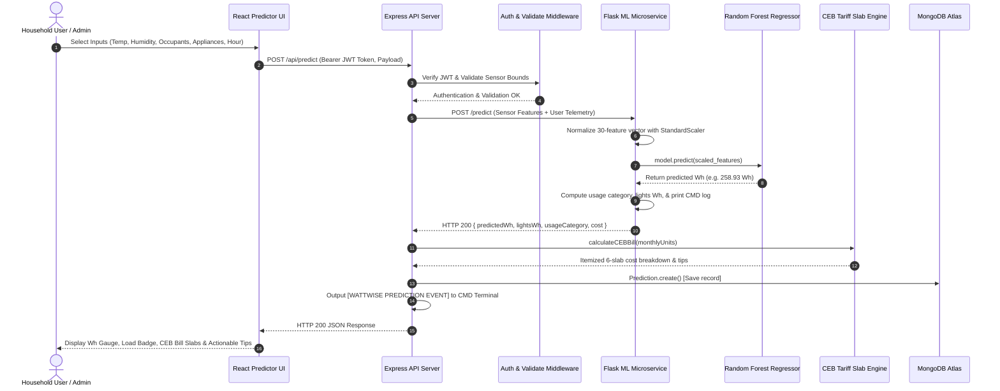
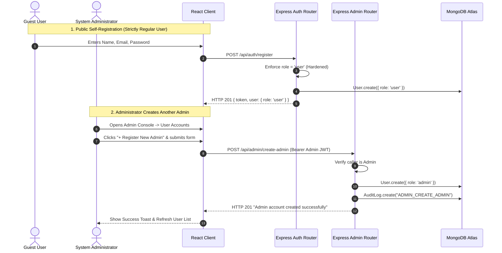
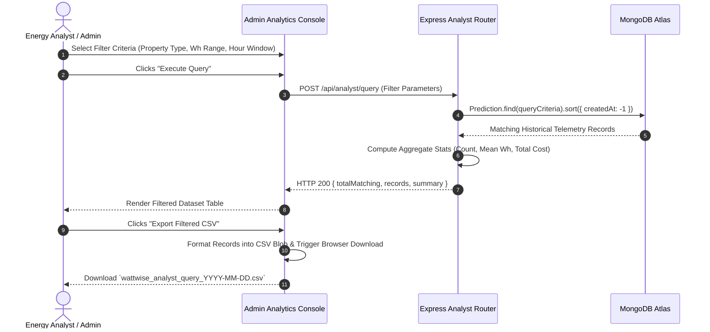
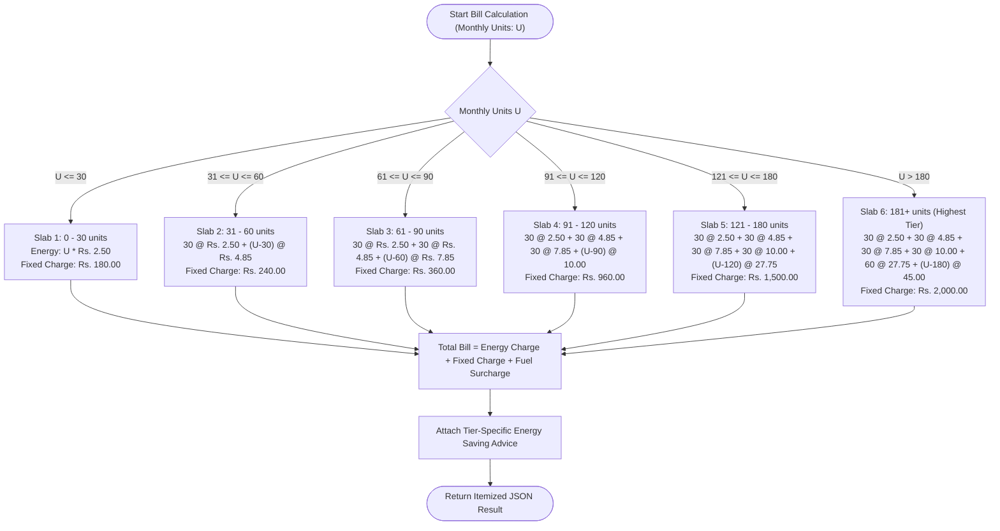
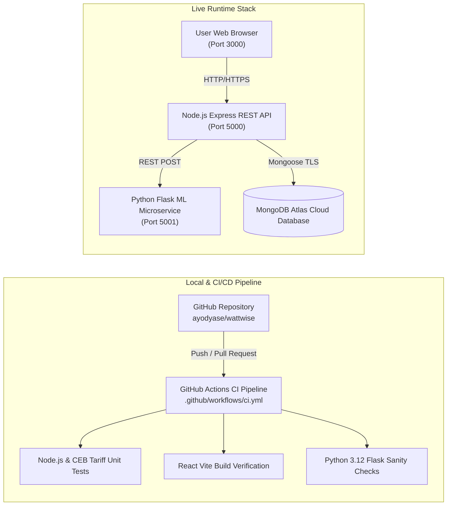

# ⚡ WattWise — Intelligent Energy Consumption Prediction & Tariff Analytics Platform


**WattWise** is a full-stack smart energy forecasting and bill estimation web application tailored for Sri Lankan residential households and commercial property managers. Powered by a **Random Forest Regressor** trained on environmental sensor and appliance telemetry, WattWise delivers hourly Wh forecasts, instant itemized **Ceylon Electricity Board (CEB) 2024 Residential Tariff** calculations, solar net-accounting payback simulations, and an enterprise multi-role administration console.

---

## 📐 System & Software Engineering Diagrams

### 1. 🏛️ High-Level System Architecture Diagram



---

### 2. 🎭 System Use Case Diagram



---

### 3. 🗄️ Database Entity-Relationship (ER) Diagram & Data Schema

The WattWise persistent data layer is implemented on **MongoDB Atlas** using **Mongoose ODM**. The schema design models relational integrity via `ObjectId` references across 7 core collections:



#### 📋 Entity Relationship & Data Dictionary

| Collection / Entity | Key Fields & Types | Cardinality & Relationships | Purpose & Integrity Constraints |
| :--- | :--- | :--- | :--- |
| **`users`** | `_id` (PK, ObjectId)<br/>`email` (UK, String)<br/>`password` (String, Hashed)<br/>`role` (Enum: `user`, `admin`)<br/>`status` (Enum: `active`, `suspended`) | • `1 : N` with `predictions`<br/>• `1 : N` with `buildings`<br/>• `1 : N` with `tips`<br/>• `1 : N` with `announcements`<br/>• `1 : N` with `auditlogs` | Core authentication & access management. Passwords hashed with 10-round bcrypt salt. Unique email indexed for fast credential lookups. |
| **`buildings`** | `_id` (PK, ObjectId)<br/>`managerId` (FK, ObjectId -> `users`)<br/>`type` (Enum: `House`, `Apartment`, `Office`, `Commercial`)<br/>`alertThresholdWh` (Number) | • `N : 1` with `users` (Manager)<br/>• `1 : N` with `alerts`<br/>• `1 : N` with `predictions` | Multi-unit property profiling and multi-floor load simulation. `managerId` references administrative manager. |
| **`predictions`** | `_id` (PK, ObjectId)<br/>`userId` (FK, ObjectId -> `users`)<br/>`buildingId` (FK, ObjectId -> `buildings`, Nullable)<br/>`predictedWh` (Number)<br/>`estimatedCostLKR` (Number) | • `N : 1` with `users`<br/>• `N : 1` with `buildings` (Optional) | Historical telemetry & ML regression log store. Contains complete environmental vector and CEB tariff financial computation. |
| **`alerts`** | `_id` (PK, ObjectId)<br/>`buildingId` (FK, ObjectId -> `buildings`)<br/>`severity` (Enum: `Medium`, `High`, `Critical`)<br/>`status` (Enum: `Active`, `Acknowledged`, `Resolved`) | • `N : 1` with `buildings` | Real-time threshold breach notifications generated when whole-building or floor predictions exceed `alertThresholdWh`. |
| **`tips`** | `_id` (PK, ObjectId)<br/>`createdBy` (FK, ObjectId -> `users`)<br/>`usageLevel` (Enum: `All`, `Low`, `Normal`, `High`, `Very High`)<br/>`appliance` (Enum: `General`, `AC / Cooling`, etc.) | • `N : 1` with `users` | Dynamic CEB conservation guidance catalog filtered by load tier and appliance category. |
| **`auditlogs`** | `_id` (PK, ObjectId)<br/>`userId` (FK, ObjectId -> `users`, Nullable)<br/>`action` (String)<br/>`ipAddress` (String) | • `N : 1` with `users` (Nullable) | Security and compliance audit trail tracking administrative actions (admin registration, role change, user suspension, ML retraining). |
| **`announcements`** | `_id` (PK, ObjectId)<br/>`createdBy` (FK, ObjectId -> `users`)<br/>`badge` (Enum: `Info`, `Tariff Update`, `Maintenance`, `Feature`)<br/>`active` (Boolean) | • `N : 1` with `users` | Global alert and broadcast notice banner system displayed across all user dashboards. |

---

### 4. 🧩 Database & Backend Class Diagram (Mongoose Models)



---

### 5. 🔄 Sequence Diagram 1: Energy Prediction & Real-Time Telemetry Flow



---

### 6. 🔐 Sequence Diagram 2: Authentication & Admin-Only Admin Creation Flow



---

### 7. 📈 Sequence Diagram 3: Energy Analyst Query & Dataset Export Flow



---

### 8. ⚡ Decision & Activity Diagram: CEB 2024 Residential Tariff Slab Algorithm



---

### 9. 🌐 Deployment & DevOps CI/CD Architecture Diagram



---

## 🌟 Key Features

### 1. 🏠 Household Energy Consumption Predictor
- Predicts hourly energy consumption in **Watt-hours (Wh)** and equivalent **kWh**.
- Accepts environmental metrics: Indoor/Outdoor Temperature (°C), Relative Humidity (%), Occupancy, Hour of Day (0–23), Day of Week, and active household appliances (AC, Refrigerator, Lighting, TV, Washing Machine, Water Heater).
- **Quick Preset Simulations**: 🌅 *Morning Routine*, ☀️ *Hot Afternoon Peak*, 🌆 *Evening High Load*, 🌙 *Night Standby*.
- Classifies load into **Low** (<80 Wh), **Normal** (80–180 Wh), **High** (181–350 Wh), and **Very High** (>350 Wh).
- Instant PDF/Print export of energy forecasts.

### 2. 🇱🇰 Sri Lanka CEB 2024 Residential Tariff Engine
Computes itemized monthly electricity bills based on the latest 2024 Ceylon Electricity Board tiered slab structure:

| Consumption Tier (kWh/month) | Energy Charge (LKR / unit) | Fixed Monthly Charge (LKR) |
| :--- | :--- | :--- |
| **0 – 30 units** | Rs. 2.50 | Rs. 180.00 |
| **31 – 60 units** | Rs. 4.85 | Rs. 240.00 |
| **61 – 90 units** | Rs. 7.85 | Rs. 360.00 |
| **91 – 120 units** | Rs. 10.00 | Rs. 960.00 |
| **121 – 180 units** | Rs. 27.75 | Rs. 1,500.00 |
| **181+ units** | Rs. 45.00 | Rs. 2,000.00 |

### 3. ☀️ Rooftop Solar & Net-Accounting Offset Simulator
- Simulates grid-tied solar PV systems (1 kW to 20 kW).
- Calculates monthly generation based on regional Sri Lankan solar irradiance (4.5 to 5.4 peak sun hours/day).
- Projects monthly Rupee savings, CEB Net-Accounting tariff credits, investment payback period (Years), and annual CO₂ carbon offset (Tons/year).

### 4. 📊 Multi-Role Administrative & Analyst Workspace
- **User Accounts Manager**: Search, filter, suspend, delete, or promote users to Administrator.
- **Admin-Only Account Creation**: Dedicated secure registration of administrative team members.
- **Energy Analyst Query Engine**: Filter dataset records by Property Type, Category, Wh bounds, and hour windows with **One-Click CSV Export**.
- **Building Manager Multi-Unit Monitor**: Register property profiles (*House*, *Apartment*, *Office*), track floor counts, and simulate whole-building energy loads.
- **Batch CSV ML Processor**: Upload/paste multi-row CSV telemetry datasets for bulk Random Forest predictions with direct CSV result download.
- **CEB Energy Tips Repository**: CRUD operations for appliance-specific energy reduction guidelines.
- **Security Audit Logs & Live Announcements**: System-wide activity trail and broadcast banners.

---

## 🛠️ Technology Stack

| Layer | Technologies |
| :--- | :--- |
| **Frontend** | React 18, Vite, Tailwind CSS, Lucide React, Recharts, Axios |
| **Backend REST API** | Node.js, Express 4, Mongoose 8, JWT (JSON Web Tokens), Bcrypt.js |
| **Database** | MongoDB Atlas / Local MongoDB |
| **Machine Learning** | Python 3.12, Flask, Flask-CORS, Scikit-Learn 1.6+, Pandas, NumPy, Joblib |
| **CI/CD Pipeline** | GitHub Actions (`.github/workflows/ci.yml`) |

---

## 🚀 Getting Started & Local Setup

### 1. Prerequisites
- **Node.js** (v18.x or v20.x recommended)
- **Python** (v3.10 to v3.12)
- **Git**

### 2. Clone the Repository
```bash
git clone https://github.com/ayodyase/wattwise.git
cd wattwise
```

### 3. Configure Environment Variables
Create a `.env` file in the root directory (or edit existing):
```env
MONGODB_URI=your_mongodb_connection_string
JWT_SECRET=your_jwt_secret_key_here
PORT=5000
FLASK_ML_URL=http://127.0.0.1:5001
NODE_ENV=development
```

---

### 4. Setup & Start Python ML Microservice
```bash
cd ml-services
python -m venv venv
.\venv\Scripts\activate          # On Windows
# source venv/bin/activate       # On Linux/macOS
pip install -r requirements.txt
python app.py
```
> Microservice starts on **`http://127.0.0.1:5001`**.

---

### 5. Setup & Start Node.js Backend API
In a second terminal:
```bash
cd backend
npm install
npm run seed     # Seeds default users, sample predictions, buildings, & tips
npm run dev      # Starts Express on port 5000
```
> Backend API starts on **`http://localhost:5000`**.

---

### 6. Setup & Start React Frontend
In a third terminal:
```bash
cd frontend
npm install
npm run dev
```
> Access the web application at **`http://localhost:3000`**.

---

## 🔑 Default Seed Credentials

After running `npm run seed` in the backend:

| Role | Email | Password | Access Capabilities |
| :--- | :--- | :--- | :--- |
| **System Admin** | `admin@wattwise.lk` | `Admin@123456` | Admin Console, Analyst Analytics, Building Manager, Retrain ML |
| **Regular User** | `user@wattwise.lk` | `User@123456` | Predictor, CEB Estimator, Solar Simulator, History Log, Profile |

---

## 🧪 Testing & Verification

### Run Automated Backend Integration Tests
```bash
cd backend
npm test
```
**Test Coverage Includes (15 / 15 Passed)**:
- Backend `/api/health` connectivity
- Exact CEB 2024 Tariff Slab mathematical accuracy (25, 50, 80, 110, 150, 200 kWh)
- User & Admin JWT authentication lifecycle
- Role security guards (verifies regular users receive `403 Forbidden` on admin endpoints)
- ML prediction endpoint integration & positive Wh output

### Build Frontend Production Assets
```bash
cd frontend
npm run build
```

---

## 📄 License
This project is open-source and available under the [MIT License](LICENSE).
